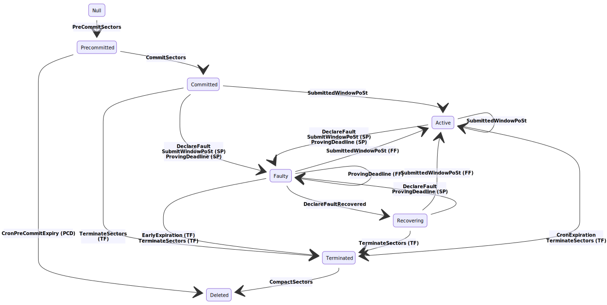

编译相关文档

[https://docs.filecoin.io/get-started/lotus](https://docs.filecoin.io/get-started/lotus/) 

**Lotus Node** 

可以同步区块链，并在此过程中验证所有区块，转移和交易。它还可以促进新存储交易的创建。对于不想为网络贡献存储，产生新块并扩展区块链的用户而言，运行此类节点是理想之选。

一个Filecoin节点：验证网络交易，管理FIL钱包，可以执行存储和检索交易。

**Lotus Storage Miner** 

可以在网络中注册为矿工，注册存储，接受交易并存储数据。 Lotus Storage Miner可以生产区块，扩展区块链并获得添加到网络中的新区块的奖励。Filecoin矿工。

**Lotus Worker** 

协助矿工执行与采矿有关的任务的工人。

查找到交易信息用lotus [store section](https://docs.filecoin.io/store/lotus) 

miners想提供存储 [mine section](https://docs.filecoin.io/mine/lotus) 

lotus的api开发集成可使用 [build section](https://docs.filecoin.io/mine/lotus) 

filecoin doc（https://docs.filecoin.io/）

filecoin Spec （https://spec.filecoin.io/）

| [lotus](https://github.com/filecoin-project/lotus)           | go   | Failed | [35%](https://codecov.io/gh/filecoin-project/lotus)          | [Reports](https://spec.filecoin.io/#section-appendix.audit_reports.lotus) |
| ------------------------------------------------------------ | ---- | ------ | ------------------------------------------------------------ | ------------------------------------------------------------ |
| [go-fil-markets](https://github.com/filecoin-project/go-fil-markets) | go   | Passed | [65%](https://codecov.io/gh/filecoin-project/go-fil-markets) | [Reports](https://spec.filecoin.io/#section-appendix.audit_reports.lotus) |
| [specs-actors](https://github.com/filecoin-project/specs-actors) | go   | Passed | [71%](https://codecov.io/gh/filecoin-project/specs-actors)   | [Reports](https://spec.filecoin.io/#section-appendix.audit_reports.actors) |
| [rust-fil-proofs](https://github.com/filecoin-project/rust-fil-proofs) | rust | Failed | [Unknown](https://codecov.io/gh/filecoin-project/rust-fil-proofs) | [Reports](https://spec.filecoin.io/#section-appendix.audit_reports.proofs) |
| [venus](https://github.com/filecoin-project/venus)           | go   | Failed | [46%](https://codecov.io/gh/filecoin-project/venus)          | Missing                                                      |
| [forest](https://github.com/ChainSafe/forest)                | rust | Failed | [Unknown](https://codecov.io/gh/ChainSafe/forest)            | Missing                                                      |
| [cpp-filecoin](https://github.com/filecoin-project/cpp-filecoin) | c++  | Passed | [30%](https://codecov.io/gh/filecoin-project/cpp-filecoin)   | Missing                                                      |

**Actor State Diagram** 

# docs.filecoin.io

## get started

### filecoin是什么

### filecoin怎么工作

### filecoin网络

https://network.filecoin.io/

### lotus安装配置

### lotus钱包

### filecoin FAQ

### 词汇表

## store

slingshot competition

store data with Slate

store data with lotus

Very large files

Retrieve data with lotus

import data from OPFS

## mine

how mining works

硬件要求

minig架构

lotus guides for miners

lotus miner安装

配置

seal workers

## build

Textile Buckets

Hosted Powergate

Glif Nodes

[Filecoin-backed pinning services](https://docs.filecoin.io/build/filecoin-pinning-services) 

lotus API

example applications

[filecoin社区资源](https://github.com/filecoin-project/docs/wiki#community-resources) 

[协议规范](https://github.com/filecoin-project/specs) 

# spec.filecoin.io

 

